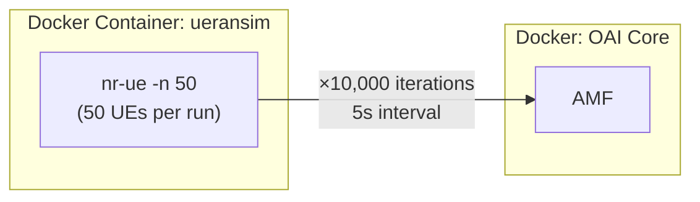
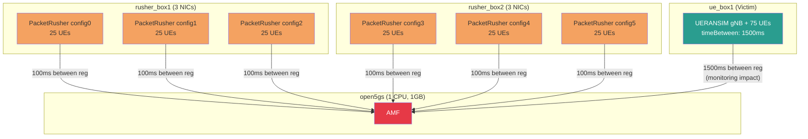
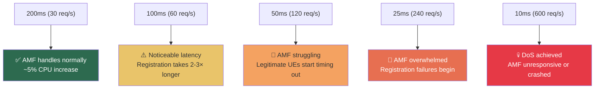
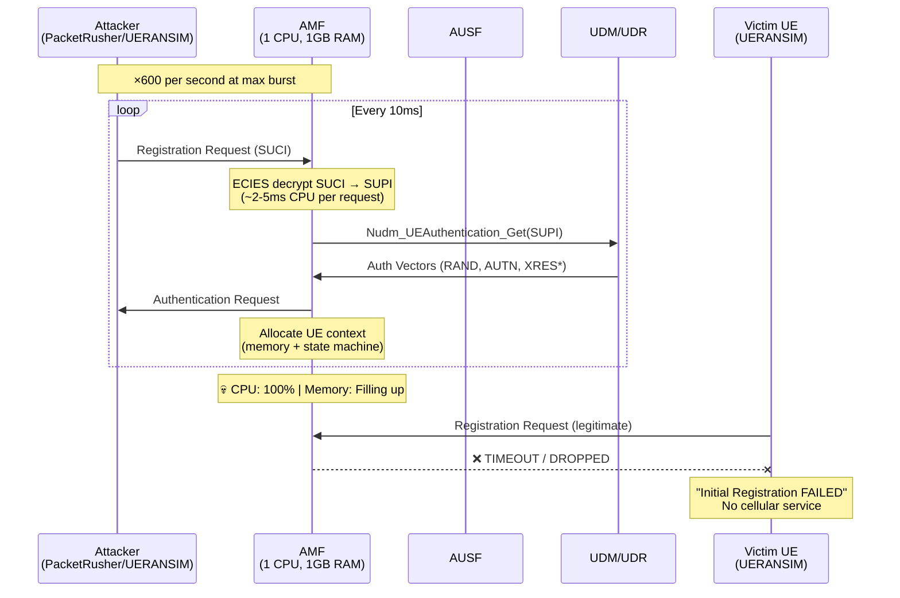

# 5G-Registration-Attack — Complete Repo Analysis

> **Repo:** [github.com/1915venu/5G-Registration-Attack](https://github.com/1915venu/5G-Registration-Attack)
> **Origin:** IIT Delhi SPRING Lab (Security & Privacy Research Innovation Group)
> **Contributor:** Prateek Bhaisora (2023JCS2564)

---

## 1. What This Repo Is

This is a **5G NAS-layer signaling attack testbed** — it implements multiple ways to flood a 5G Core Network's **AMF (Access and Mobility Management Function)** with Registration Requests to cause **Denial of Service**. The repo provides **four distinct attack approaches**, from high-level simulator-based flooding to low-level raw packet crafting.

---

## 2. Repository Structure

```
5G-Registration-Attack/
├── cn-configs/                         ← Core Network setup (3 CN choices)
│   ├── README.md
│   ├── docker_open5gs/                 ← Open5GS Docker deployment
│   ├── free5gc-compose/                ← Free5GC Docker deployment
│   └── oai-cn5g-fed/                   ← OpenAirInterface Docker deployment
│
├── using-oai-ueransim/                 ← ATTACK APPROACH 1: OAI + UERANSIM Docker
│   ├── Attack.sh                       ← 🔴 The attack script (10000 × 50 UEs)
│   ├── benign.sh                       ← 🟢 Benign baseline (10 × 1 UE)
│   └── read me.docx
│
├── using-open5gs-packetrusher-ueransim/ ← ATTACK APPROACH 2: Multi-VM burst attack
│   ├── README.md
│   ├── Vagrantfile                     ← 4-VM topology (1 core + 2 rushers + 1 UE)
│   ├── run_as.py                       ← 🔴 Python orchestrator (variable timing)
│   ├── run_as.sh                       ← 🔴 Shell attack (6 PacketRusher + UERANSIM)
│   ├── run_ue_box2_config.sh           ← Register-Deregister loop script
│   ├── as_metrics_1/                   ← Collected attack metrics
│   └── shared/                         ← Shared configs between VMs
│
├── custom-packet-scripts/              ← ATTACK APPROACH 3: Raw packet crafting
│   ├── README.md
│   ├── requirements.txt                ← pycrate + pysctp
│   ├── decoders/                       ← Protocol decoders
│   │   ├── decode_nas.py               ← Decode NAS-5G messages
│   │   ├── decode_ngap.py              ← Decode NGAP messages
│   │   ├── decode_rrc.py               ← Decode RRC messages
│   │   └── decode_sctp.py              ← Decode SCTP frames
│   ├── packets/                        ← Packet senders (THE ATTACK TOOLS)
│   │   ├── send_ng_setup_req.py        ← Craft & send NGAP Setup Request
│   │   ├── send_reg_nas.py             ← 🔴 Craft & send NAS Registration Request
│   │   └── send_rrc_msg.py             ← Craft & send RRC messages
│   ├── procedures/
│   │   └── trigger_auth/               ← Trigger authentication procedures
│   └── servers/
│       └── test_amf.py                 ← Mock AMF SCTP server for testing
│
└── scapy-based-attack/                 ← ATTACK APPROACH 4: Scapy (placeholder)
    └── once_done_add_files_here        ← 🚧 Not yet implemented
```

---

## 3. The Four Attack Approaches (Detailed)

### 3.1 🔴 Approach 1: OAI + UERANSIM Docker Flood

**Files:** `using-oai-ueransim/Attack.sh` and `benign.sh`

**How it works:**



**Attack script (`Attack.sh`) breakdown:**
```bash
COMMAND="/ueransim/bin/nr-ue -c /ueransim/etc/custom-ue.yaml -n 50"
REPEAT=10000      # Run the command 10,000 times
TIMEOUT=5         # 5 seconds between each batch
```

- Spawns **50 UEs simultaneously** per iteration
- Repeats **10,000 times** with 5-second intervals
- Total: **500,000 registration attempts** over ~14 hours
- Runs via `docker exec -d` (detached) inside the UERANSIM container

**Benign baseline (`benign.sh`):**
```bash
COMMAND="/ueransim/bin/nr-ue -c /ueransim/etc/custom-ue.yaml -n 1"
REPEAT=10         # Only 10 runs
TIMEOUT=5
INTERVAL=3        # 3 seconds between runs
```
- Only 1 UE per run, 10 iterations = **10 registrations** (normal traffic for comparison)

---

### 3.2 🔴 Approach 2: Multi-VM PacketRusher + UERANSIM Burst Attack

**Files:** `using-open5gs-packetrusher-ueransim/`

This is the **most sophisticated attack** — uses a 4-VM Vagrant topology with multiple attack vectors simultaneously.

**Infrastructure (from `Vagrantfile`):**

| VM | Role | Resources | IP Addresses |
|---|---|---|---|
| `open5gs` | 5G Core (target) | 1 CPU, 1GB RAM | `192.168.56.100`, `192.168.56.101` |
| `rusher_box1` | Attacker #1 | 2 CPUs, 2GB RAM | `192.168.56.120`, `.121`, `.122` |
| `rusher_box2` | Attacker #2 | 2 CPUs, 2GB RAM | `192.168.56.123`, `.124`, `.125` |
| `ue_box1` | Victim/Monitor UE | 2 CPUs, 2GB RAM | `192.168.56.130` |

> [!IMPORTANT]
> The Core is deliberately **resource-constrained** (1 CPU, 1GB RAM) to realistically simulate how attack impacts scale. The attackers get 2× the resources.

**Attack topology:**



**Attack shell script (`run_as.sh`) step by step:**

1. **Start core**: `vagrant ssh open5gs` → run all Open5GS NFs
2. **Start tshark**: Capture NGAP traffic on port 38412 (`bridge102`)
3. **Launch 6 PacketRusher instances** (3 per box), each with:
   - `--number-of-ues 25` (25 UEs per instance)
   - `--timeBetweenRegistration 100` (100ms between registrations)
   - `--loop` (continuous loop)
4. **Launch UERANSIM victim**: 75 UEs with 1500ms interval (legitimate traffic)
5. **Wait 90 seconds** (attack duration)
6. **Capture + iperf3 QoS measurement**: Test throughput degradation

**Total attack load:** 6 instances × 25 UEs × (1000ms/100ms) = **~150 registrations/second sustained**

**Python orchestrator (`run_as.py`):**
```python
list_of_timeBetweenRegistration = [200, 150, 100, 75, 50, 25, 10]
```
- Runs the attack **at increasing intensities** (from 200ms→10ms between registrations)
- Tests both `reg` (registration only) and `unreg` (with deregistration) modes
- Captures pcap at each intensity level
- Calls `registration.get_time_taken_to_complete_registration(file)` to analyze impact
- Each run lasts **600 seconds (10 minutes)**

**Register-Deregister Loop (`run_ue_box2_config.sh`):**
```bash
# For each SUPI in range:
nr-ue -c ue.yaml -i $SUPI          # Register
# Wait for "Initial Registration is successful"
nr-cli imsi-$SUPI -e "deregister switch-off"  # Immediately deregister
# Repeat with next SUPI
```
This creates a **rapid register→deregister loop** that continuously creates and tears down NAS security contexts.

---

### 3.3 🔴 Approach 3: Custom Packet Crafting (pycrate + pysctp)

**Files:** `custom-packet-scripts/`

This is the **lowest-level attack** — hand-crafts NAS and NGAP protocol messages in Python and sends them directly over SCTP to the AMF.

**`send_reg_nas.py` — Crafted NAS Registration Request:**

```python
reg_msg = FGMMRegistrationRequest()

# Set 5GMM Header
reg_msg['5GMMHeader']['EPD'].set_val(126)     # 5G Mobility Management
reg_msg['5GMMHeader']['SecHdr'].set_val(0)     # No security (plain NAS)
reg_msg['5GMMHeader']['Type'].set_val(65)      # Registration Request

# Set NAS Key Set Identifier
reg_msg['NAS_KSI'].set_IE(val={'TSC': 0, 'Value': 7})  # No valid KSI

# Registration type: Initial Registration with Follow-On Request
reg_msg['5GSRegType'].set_IE(val={'FOR': 1, 'Value': 1})

# SUCI with ECIES-encrypted SUPI (concealed identity)
reg_msg['5GSID'].set_IE(val={
    'Type': 1,           # SUCI
    'PLMN': '99f907',   # MCC=999, MNC=70
    'ProtSchemeID': 1,   # ECIES Profile A
    'HNPKID': 1,         # Home Network Public Key ID
    'Output': {
        'ECCEphemPK': ...,  # Ephemeral public key
        'CipherText': ...,  # Encrypted SUPI
        'MAC': ...          # Message Authentication Code
    }
})

# UE Security Capabilities (all algorithms supported)
reg_msg['UESecCap'].set_IE(val={
    '5G-EA0': 1, '5G-EA1_128': 1, '5G-EA2_128': 1, '5G-EA3_128': 1,
    '5G-IA0': 1, '5G-IA1_128': 1, '5G-IA2_128': 1, '5G-IA3_128': 1,
    # ... EEA/EIA too
})
```

**Key insight:** This sends a **SUCI with `ProtSchemeID=1` (ECIES)** — meaning the AMF must perform expensive **elliptic curve decryption** for every single crafted packet before it can even determine if the subscriber exists.

**`send_ng_setup_req.py` — Fake gNB NGAP Setup:**

```python
# Craft an NGSetupRequest pretending to be a gNB
IEs = [
    GlobalRANNodeID: gNB-ID=(1,32), PLMN=999/70
    RANNodeName: 'UERANSIM-gnb-999-70-1'
    SupportedTAList: TAC=0x000001, SST=1,2  (two slices)
    PagingDRX: v128
]
# Send over SCTP to AMF port 38412
sock = sctp.sctpsocket_tcp(socket.AF_INET)
sock.sctp_send(msg=ng_setup_req, ppid=60)  # NGAP PPID=60
```

This establishes a **rogue gNB connection** to the AMF — a prerequisite for sending NAS messages.

**`test_amf.py` — Mock AMF for development:**
- SCTP server listening on port 38412
- Receives and decodes NGAP messages
- Used to test crafted packets before attacking real Open5GS

---

### 3.4 🚧 Approach 4: Scapy-Based Attack (Planned)

**Files:** `scapy-based-attack/once_done_add_files_here`

Placeholder directory — not yet implemented. Would likely use the `spring-iitd/scapy` fork which has mobile protocol extensions.

---

## 4. Attack Parameters & Limits — The "Burst" Question

### What is a "Burst Attack" in This Context?

The `run_as.py` script systematically tests **7 intensity levels**:

| `timeBetweenRegistration` | Effective Rate | Classification |
|---|---|---|
| **200ms** | ~5 reg/s per instance × 6 = **30 reg/s** | Low intensity |
| **150ms** | ~6.7 reg/s × 6 = **40 reg/s** | Mild |
| **100ms** | ~10 reg/s × 6 = **60 reg/s** | Medium |
| **75ms** | ~13.3 reg/s × 6 = **80 reg/s** | High |
| **50ms** | ~20 reg/s × 6 = **120 reg/s** | Very High |
| **25ms** | ~40 reg/s × 6 = **240 reg/s** | Burst / Extreme |
| **10ms** | ~100 reg/s × 6 = **600 reg/s** | Maximum burst |

> [!WARNING]
> At **10ms intervals**, this generates ~**600 registration requests per second** from 6 PacketRusher instances alone, plus 75 UERANSIM UEs. A 1-CPU, 1GB-RAM Open5GS instance **will crash or become completely unresponsive** at this rate.

### What Breaks and When



### The Two Attack Modes

The `run_as.py` tests two modes:

| Mode | What Happens | Impact |
|---|---|---|
| `reg` (registration only) | UEs register and stay registered | AMF must maintain state for all UEs → **memory exhaustion** |
| `unreg` (register + deregister) | UEs register then immediately deregister | AMF constantly creates/destroys context → **CPU exhaustion** |

---

## 5. The Complete Attack Flow (What's Happening at Protocol Level)



### Why Each Step Hurts the AMF

| Step | CPU Cost | Memory Cost | Why It's Bad |
|---|---|---|---|
| **SUCI → SUPI decryption** | ~2-5ms (ECIES crypto) | Minimal | Can't be skipped — must decrypt before validation |
| **UDM query** | ~1ms (HTTP2/SBI) | DB connection pool | MongoDB lookup per request |
| **Auth vector generation** | ~1-2ms (MILENAGE) | ~200 bytes per AV | Crypto computation |
| **UE context allocation** | ~0.5ms | ~2-5 KB per context | State machine + timers |
| **SCTP handling** | ~0.1ms | File descriptors | Each NGAP association = resources |

**Total per registration:** ~5-10ms CPU + ~3-5KB memory

**At 600 req/s:** 100% CPU utilization, ~2-3 MB/s memory growth

---

## 6. Core Network Configurations

The repo supports testing against **three different 5G Core implementations**:

| Core Network | Deployment | Purpose |
|---|---|---|
| **Open5GS** | Docker + Vagrant | Primary attack target (most widely used in research) |
| **Free5GC** | Docker Compose | Secondary target (Go-based, different architecture) |
| **OpenAirInterface (OAI)** | Docker Compose | Third target (C-based, more production-like) |

This allows comparing **how different AMF implementations handle the same attack load**.

---

## 7. The Measurement & Analysis Pipeline

The repo doesn't just attack — it **measures the impact**:

1. **tshark capture** on `bridge102`, filtered to NGAP port `38412`
   ```bash
   tshark -i bridge102 -f 'port 38412' -w attack_capture.pcap
   ```

2. **Registration timing analysis** via `registration.py`:
   ```python
   reg.get_time_taken_to_complete_registration(file)
   ```
   Parses pcap to measure how long each registration takes under attack

3. **QoS measurement** via iperf3:
   ```bash
   # Server on rusher_box1
   iperf3 -s -D
   # Client through UE tunnel
   nr-binder 10.45.0.3 iperf3 -c 10.211.55.225 -u -b 50M
   ```
   Measures throughput degradation for data-plane users during attack

4. **Metrics collection** in `as_metrics_1/` — results from actual experiment runs

---

## 8. Summary: All Attack Vectors & Their Limits

| Attack | Approach | Max Rate | When AMF Breaks | DoS Type |
|---|---|---|---|---|
| **Docker UERANSIM flood** | Approach 1 | ~50 UEs × 10000 iter | After ~100-500 iterations | Memory exhaustion (stateful) |
| **PacketRusher multi-VM burst** | Approach 2 | **600 reg/s** (at 10ms interval) | Within 10-30 seconds at 10ms | CPU exhaustion |
| **Register-Deregister loop** | Approach 2 (variant) | ~100-500 cycles/s | Within 1-2 minutes | CPU + state churn |
| **Raw NAS packet crafting** | Approach 3 | **Unlimited** (raw sockets) | Instant at high rate | SUCI decryption exhaustion |
| **Fake gNB NGAP Setup** | Approach 3 | SCTP limit (~64-128) | When associations exhausted | Connection exhaustion |
| **Scapy-based** | Approach 4 | 🚧 Not implemented | — | — |

### The Key Limits

> [!IMPORTANT]
> **Hardware constraints are the real limiter:**
> - Open5GS AMF on 1 CPU = breaks at ~120-240 req/s sustained
> - PacketRusher per instance = ~25-100 UEs depending on `timeBetweenRegistration`
> - UERANSIM per instance = ~50-200 UEs
> - Raw pycrate packets = limited only by network bandwidth (~10K+ req/s possible)
> - The **10ms burst** is the most aggressive tested; going lower risks SCTP congestion/drops

> [!TIP]
> The raw packet approach (`send_reg_nas.py`) is potentially the **most dangerous** because:
> 1. No simulator overhead — direct SCTP→NGAP→NAS
> 2. Can randomize SUCI values (spoofing) without needing valid IMSI
> 3. Forces ECIES decryption per packet even for non-existent subscribers
> 4. Can be parallelized trivially with threading

---

## 9. What's NOT in This Repo (But Could Be Added)

Based on the architecture, these additional attacks are feasible:

1. **SUCI randomization flood** — Modify `send_reg_nas.py` to generate random ECIES-encrypted payloads per request
2. **Multi-slice exhaustion** — The NGAP setup supports `SST=1,2` (two slices); could target each independently
3. **NAS replay attacks** — Capture a valid registration pcap and replay it
4. **AMF state corruption** — Send malformed NAS sequences to trigger edge cases in state machines
5. **SCTP INIT flood** — Flood SCTP INIT packets without completing the 4-way handshake
