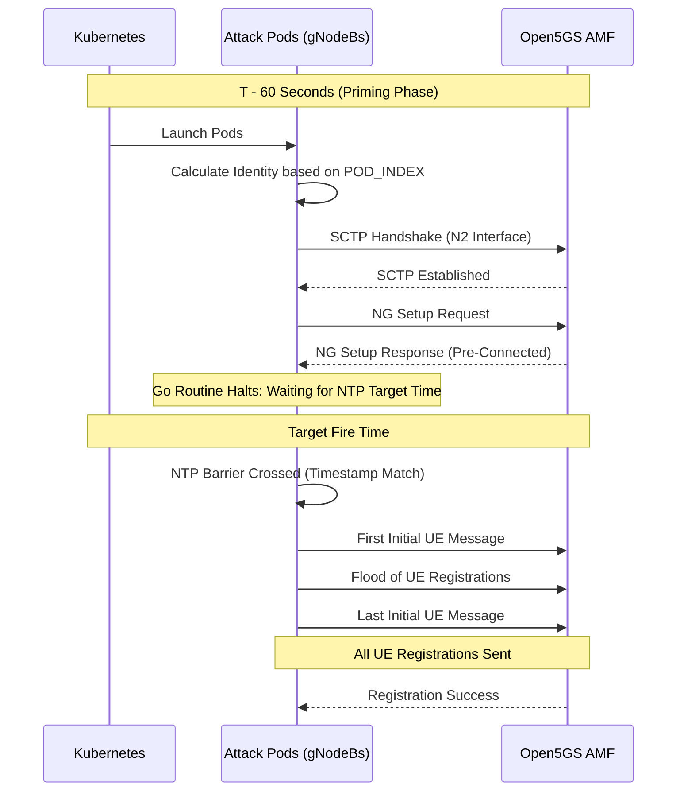

# Architectural Analysis: Synchronized Distributed 5G Registration Attack

This document provides a comprehensive technical breakdown of **Method 3 (Post-SCTP Synchronization)**, the resulting network footprint vulnerabilities, the roadmap for evasion, and detailed PCAP timing analyses from all test runs.

---

## 1. Technical Approach: Post-SCTP Synchronization (Method 3)
Traditional scripts attempt to synchronize execution by using bash `sleep`, and then starting the process. However, this includes the SCTP handshake and NG Setup procedure in the timing window, introducing massive network jitter (~200ms-400ms).

Method 3 "primes" the attack by moving the synchronization barrier into the Go runtime *after* the connection phase. 

### The Synchronization Flow
1. **Pre-connection**: The gNodeBs establish SCTP associations and complete `NG Setup` with the AMF **first**. 
2. **The Barrier**: The UEs are held at a "Starting Line" inside the Go runtime.
3. **The Flood**: Once the synchronized timestamp (UTC) is reached, all UEs are released simultaneously over the pre-established sockets.

### Architectural Patches

| Component | What We Changed | Why We Did It |
| :--- | :--- | :--- |
| **Go Code (Timer)** | Put the countdown timer inside the Go source code instead of the bash script. | This lets the pods connect to the AMF *before* the timer hits zero, removing connection delays from the attack window. |
| **Go Code (Ports)** | Changed the code so it doesn't force a specific starting port. | When all pods share the same host IP, they would crash fighting over the same port. This lets the Linux OS automatically give each pod a unique port. |
| **Startup Script** | Used math and the Pod's Index number to auto-generate unique IDs (IMSI, GNB_ID) on startup. | If 5 pods try to connect acting like the exact same cell tower, the AMF drops them. This tricks the AMF into thinking distinct cell towers are connecting. |
| **Network Config** | Bypassed Kubernetes networking and pointed the attack straight at the AMF's direct IP address. | Kubernetes networking adds 10-50 milliseconds of random delay to packets. Bypassing it ensures maximum speed and accuracy. |

---

## 2. PCAP Timing Analysis

### Test 1: Baseline — 5 Pods × 10 UEs = 50 UEs
**Date:** March 15, 2026 — 18:23 UTC  
**PCAP:** `/home/venu/Desktop/5G-Registration-Attack/amf_attack_preconnect_proof.pcap`

#### Pod Barrier Times
| Pod | Barrier Time | Delta |
|---|---|---|
| pod-2 | 18:23:11.**315** | 0 ms |
| pod-0 | 18:23:11.**341** | +26 ms |
| pod-4 | 18:23:11.**350** | +35 ms |
| pod-1 | 18:23:11.**369** | +54 ms |
| pod-3 | 18:23:11.**373** | +58 ms |

#### UE Registration Window
| Metric | Value |
|---|---|
| First UE Pkt | 18:23:11.**316** |
| Last UE Pkt | 18:23:11.**418** |
| **Window** | **102 ms** |
| Success | **50/50 (100%)** |

---

### Test 2: Scale Run 1 — 20 Pods × 50 UEs = 1000 UEs
**Date:** March 19, 2026 — 12:41 UTC  
**PCAP:** `/home/venu/Desktop/5G-Registration-Attack/1000ue_attack.pcap`

#### Pod Barrier Times
| Pod | Barrier Time | Delta |
|---|---|---|
| pod-14 | 12:41:16.**064** | 0 ms |
| pod-16 | 12:41:16.**094** | +31 ms |
| pod-10 | 12:41:16.**095** | +31 ms |
| pod-13 | 12:41:16.**117** | +54 ms |
| pod-19 | 12:41:16.**134** | +71 ms |
| pod-15 | 12:41:16.**139** | +76 ms |
| pod-9  | 12:41:16.**142** | +78 ms |
| pod-17 | 12:41:16.**150** | +86 ms |
| pod-18 | 12:41:16.**153** | +90 ms |
| pod-1  | 12:41:16.**755** | +691 ms |
| pod-3  | 12:41:16.**756** | +692 ms |
| pod-2  | 12:41:16.**767** | +704 ms |
| pod-0  | 12:41:16.**785** | +721 ms |
| pod-4  | 12:41:16.**839** | +775 ms |
| pod-5  | 12:41:16.**842** | +778 ms |
| pod-12 | 12:41:16.**948** | +884 ms |
| pod-6  | 12:41:16.**960** | +897 ms |
| pod-7  | 12:41:16.**984** | +920 ms |
| pod-8  | 12:41:17.**015** | +951 ms |
| pod-11 | 12:41:17.**051** | +988 ms |

#### UE Registration Window
| Metric | Value |
|---|---|
| First UE Pkt | 12:41:16.**064** |
| Last UE Pkt | 12:41:17.**215** |
| **Window** | **1151 ms** |
| Success | **948/1000 (94.8%)** |

---

### Test 3: Scale Run 2 — 20 Pods × 50 UEs = 1000 UEs
**Date:** March 19, 2026 — 14:10 UTC  
**PCAP:** `/home/venu/Desktop/5G-Registration-Attack/1000ue_attack_v2.pcap`

#### Pod Barrier Times
| Pod | Barrier Time | Delta |
|---|---|---|
| pod-4  | 14:10:59.**336** | 0 ms |
| pod-0  | 14:10:59.**381** | +45 ms |
| pod-2  | 14:10:59.**393** | +57 ms |
| pod-1  | 14:10:59.**403** | +67 ms |
| pod-6  | 14:10:59.**406** | +70 ms |
| pod-3  | 14:10:59.**440** | +104 ms |
| pod-8  | 14:10:59.**633** | +297 ms |
| pod-15 | 14:10:59.**735** | +399 ms |
| pod-5  | 14:10:59.**739** | +403 ms |
| pod-14 | 14:10:59.**748** | +412 ms |
| pod-11 | 14:10:59.**806** | +470 ms |
| pod-17 | 14:10:59.**808** | +472 ms |
| pod-16 | 14:10:59.**809** | +473 ms |
| pod-12 | 14:10:59.**811** | +475 ms |
| pod-19 | 14:10:59.**826** | +490 ms |
| pod-13 | 14:10:59.**838** | +502 ms |
| pod-9  | 14:10:59.**844** | +508 ms |
| pod-7  | 14:10:59.**847** | +511 ms |
| pod-18 | 14:10:59.**871** | +535 ms |
| pod-10 | 14:10:59.**872** | +536 ms |

#### UE Registration Window
| Metric | Value |
|---|---|
| First UE Pkt | 14:10:59.**337** |
| Last UE Pkt | 14:11:00.**123** |
| **Window** | **786 ms** |
| Success | **931/1000 (93.1%)** |

---

## 3. Summary Comparison

| Metric | 50 UEs | 1000 UEs (Run 1) | 1000 UEs (Run 2) |
|---|---|---|---|
| Pods | 5 | 20 | 20 |
| UEs/Pod | 10 | 50 | 50 |
| Pod Sync Window | **58 ms** | 988 ms | **536 ms** |
| UE Packet Window | **102 ms** | 1151 ms | **786 ms** |
| Success Rate | **100%** | 94.8% | 93.1% |
| AMF Status | Healthy | Congested | Congested |

> [!NOTE]
> The AMF begins dropping authentication responses at ~930 concurrent registrations. This is the control-plane saturation point on this hardware (8-core, 32GB, single AMF instance).

---

## 4. The "Single IP" Vulnerability Analysis
Because all pods use `hostNetwork` on a single physical Ubuntu host, every packet carries the same source IP. A security-conscious AMF could immediately flag 1000 UE registrations from one IP as a **Distributed Registration DoS Attack**.

### The Defense Dilemma
However, this architecture mirrors a real-world **High-Density Public Area** (stadium, airport) where one physical gNodeB legitimately represents thousands of UEs. Blocking that single IP creates a "Defense Dilemma" by potentially isolating thousands of legitimate subscribers.

---

## 5. Further Work & Roadmap

- **Multi-Node IP Diversity**: Deploy across 3-4 physical worker nodes with `topologySpreadConstraints` to defeat IP-based blocking.
- **AMF Stress Testing**: Increase to 2000+ UEs to find the crash point vs. degradation point.
- **Data-Plane Simulation**: Initiate **PDU Session Establishment** after registration to stress SMF/UPF.
- **Smart Jitter**: Introduce Gaussian-distributed delays (1-5s) to mimic organic "flash events" instead of synthetic machine traffic.
